The code and the raw and clean data for the project could be found in:
<https://github.com/longm89/Dengue_prediction>

## Introduction

The purpose of the project is to predict the number of dengue cases in
two cities, San Juan and Iquitos for each week, using environmental and
climate variables. The challenge was organized in 2015 by several
departments in the U.S. Federal Government, with the support of the
Pandemic Prediction and Forecasting Science and Technology Interagency
Working Group under the National Science and Technology Council
(<https://dengueforecasting.noaa.gov/>).

#### Data

The data for each city consists of:

-   Time indicators
-   NOAA’s GHCN daily climate data weather station measurements.  
-   PERSIANN satellite precipitation measurements.  
-   NOAA’s NCEP Climate Forecast System Reanalysis measurements.
-   Satellite vegetation.
-   The number of cases for each week.

Additionally, we downloaded the environmental, social and economic data
from WorldBank and we chose several parameters that might explain the
number of cases:

-   forest\_area\_sq\_km
-   Total population  
-   population\_density\_people\_per\_sq\_km\_of\_land\_area  
-   gdp\_current\_us  
-   employment\_to\_population\_average  
-   Population age percentage: 0 - 9, 10 - 20, 20 - 60, 60+

Another data that can affect the spread of the disease is the number of
migration, however, we couldn’t find the data.

#### Methods

We will model the total number of cases using the following models:

-   Model GAM with the Negative Binomial Distribution family  
-   Regression Tree  
-   Random Forest  
-   Times Series (ARIMA)  
-   Gradient Tree Boosting  
-   Expert Aggregation (EG)

As our data is count data, we will be using the Poisson distribution and
the Negative Binomial Distribution family when we apply the models GAM
and Gradient Tree Boosting. The metric to judge the quality of the
models in the competition is the MAE score, but we will also look at R
squared, deviance explained, ACF, PACF graphs and plot of the residuals.
In general, our out-of the box models achieve good results without much
tuning. There are many places where the results could be improved. For
example, there are some models with residuals of mean 0, but with
changes in the variance, we could have applied an ARIMA model to the
residuals of the model GAM, or we could fine-tune more the parameters of
the models and do more feature engineering.

## Data Wrangling and Exploration

#### Data Wrangling

##### Data from the challenge

The data for each city consists of:

-   Time indicators:
    -   week\_start\_date  
    -   weekofyear
    -   year
-   NOAA’s GHCN daily climate data weather station measurements.
    -   station\_max\_temp\_c - maximum temperature  
    -   station\_min\_temp\_c - minimum temperature  
    -   station\_avg\_temp\_c - average temperature  
    -   station\_precip\_mm - total precipitation  
    -   station\_diur\_temp\_rng\_c - diurnal temperature range
-   PERSIANN satellite precipitation measurements.
    -   precipitation\_amt\_mm - total precipitation  
-   NOAA’s NCEP Climate Forecast System Reanalysis measurements.
    -   reanalysis\_sat\_precip\_amt\_mm – Total precipitation
    -   reanalysis\_dew\_point\_temp\_k – Mean dew point temperature
    -   reanalysis\_air\_temp\_k – Mean air temperature
    -   reanalysis\_relative\_humidity\_percent – Mean relative humidity
    -   reanalysis\_specific\_humidity\_g\_per\_kg – Mean specific
        humidity
    -   reanalysis\_precip\_amt\_kg\_per\_m2 – Total precipitation
    -   reanalysis\_max\_air\_temp\_k – Maximum air temperature
    -   reanalysis\_min\_air\_temp\_k – Minimum air temperature
    -   reanalysis\_avg\_temp\_k – Average air temperature
    -   reanalysis\_tdtr\_k – Diurnal temperature range
-   Satellite vegetation: Normalized difference vegetation index
    -   ndvi\_se – Pixel southeast of city centroid
    -   ndvi\_sw – Pixel southwest of city centroid
    -   ndvi\_ne – Pixel northeast of city centroid
    -   ndvi\_nw – Pixel northwest of city centroid

We separate the csv file, including environmental data of the two
countries, into one file for each country and add the missing values
using spline interpolation.

##### Data from WorldBank

We download the data from WorldBank, clean and select important
variables that might contribute to the prediction of the number of
Dengue cases:  
\* Total population  
\* population\_density\_people\_per\_sq\_km\_of\_land\_area  
\* forest\_area\_sq\_km  
\* gdp\_current\_us  
\* employment\_to\_population\_average  
\* Population age percentage: 0 - 9, 10 - 20, 20 - 60, 60+

These two sources of data form the following groups:  
\* Time of the year  
\* Climate variables  
\* Total population  
\* Population density  
\* Population age  
\* Economical condition

The code for cleaning the data could be found in:
Dengue\_prediction/R/wrangle-data.R. We import the clean data:

    # import the cleaned data
    load("rdas/merged_iq_train.rda")
    load("rdas/merged_sj_train.rda")

##### Features engineering

In later sections, we will apply classical machine learning models such
that Generalized Additive Model, Regression Tree, Random Forest, Arima
model. As the number of cases is a time series: the number of cases of a
week is highly influenced by the number of cases of the previous week,
in order to have independent residual errors, we will add lag variables
to reduce their auto-correlation. Our model will be able to use the
number of cases from the past weeks to predict the number of cases of
the current week.

    #Add the lagging variables by 1-5 weeks

    #for Iquitos
    merged_iq_train <- merged_iq_train %>%
      mutate(lag_1_total_cases = lag(total_cases))
    merged_iq_train[1, "lag_1_total_cases"] = 0
    merged_iq_train <- merged_iq_train %>%
      mutate(lag_2_total_cases = lag(lag_1_total_cases))
    merged_iq_train[1:2, "lag_2_total_cases"] = 0
    merged_iq_train <- merged_iq_train %>%
      mutate(lag_3_total_cases = lag(lag_2_total_cases))
    merged_iq_train[1:3, "lag_3_total_cases"] = 0
    merged_iq_train <- merged_iq_train %>%
      mutate(lag_4_total_cases = lag(lag_3_total_cases))
    merged_iq_train[1:4, "lag_4_total_cases"] = 0
    merged_iq_train <- merged_iq_train %>%
      mutate(lag_5_total_cases = lag(lag(lag_3_total_cases)))
    merged_iq_train[1:5, "lag_5_total_cases"] = 0

    # for San Juan
    merged_sj_train <- merged_sj_train %>%
      mutate(lag_1_total_cases = lag(total_cases))
    merged_sj_train[1, "lag_1_total_cases"] = 0
    merged_sj_train <- merged_sj_train %>%
      mutate(lag_2_total_cases = lag(lag_1_total_cases))
    merged_sj_train[1:2, "lag_2_total_cases"] = 0
    merged_sj_train <- merged_sj_train %>%
      mutate(lag_3_total_cases = lag(lag_2_total_cases))
    merged_sj_train[1:3, "lag_3_total_cases"] = 0
    merged_sj_train <- merged_sj_train %>%
      mutate(lag_4_total_cases = lag(lag_3_total_cases))
    merged_sj_train[1:4, "lag_4_total_cases"] = 0
    merged_sj_train <- merged_sj_train %>%
      mutate(lag_5_total_cases = lag(lag(lag_3_total_cases)))
    merged_sj_train[1:5, "lag_5_total_cases"] = 0

We add a dummy variable Time term to model trend in the data over time.

    # We add the Time term 
    merged_iq_train$Time <- seq.int(nrow(merged_iq_train))
    merged_sj_train$Time <- seq.int(nrow(merged_sj_train))

#### Data Exploration

##### Visualising the number of cases over the year:

For Iquitos:

    ######## For Iquitos
    # Define Start and end times for the subset as R objects that are the time class
    startTime_iq <- as.Date("2001-01-01")
    endTime_iq <- as.Date("2009-12-24")
    # create a start and end time R object
    limits_iq <- c(startTime_iq, endTime_iq)
    iq_weekly_cases <- ggplot(merged_iq_train, aes(week_start_date, total_cases)) +
      geom_line(na.rm=TRUE) + 
      geom_ma(ma_fun = SMA, n = 52) + # moving average with period of 52 weeks to detect trend
      ggtitle("Total number of cases from 2001 - 2010 in Iquitos") +
      xlab("Date") + ylab("Total number of cases")
    # format x-axis: dates
    iq_weekly_cases_time_series <- iq_weekly_cases + 
      (scale_x_date(limits = limits_iq,
                    breaks = date_breaks("1 year"),
                    labels = date_format("%b %y")))
    iq_weekly_cases_time_series

    # looking for seasonality over the week of the year
    merged_iq_train %>% filter("2001" <= year & year <= "2009") %>% 
      ggplot(aes(x = weekofyear, y = total_cases, color = factor(year))) +
      geom_line()

The blue dot line is the moving average of 52 weeks, indicating the
trend in the series. We also plot the number of cases over the year, and
we see that there are more cases on weeks 1-10 and weeks 40-52.

    # For San Juan
    # create a start and end time R object
    startTime_sj <- as.Date("1990-04-30")
    endTime_sj <- as.Date("2000-04-22")

    limits_sj <- c(startTime_sj, endTime_sj)
    sj_weekly_cases <- ggplot(merged_sj_train, aes(week_start_date, total_cases)) +
      geom_line(na.rm=TRUE) + 
      geom_ma(ma_fun = SMA, n = 52) + # moving average with period of 52 weeks to detect trend
      ggtitle("Total number of cases from 1990 - 2008 in San Juan") +
      xlab("Date") + ylab("Total number of cases")
    # format x-axis: dates
    sj_weekly_cases_time_series <- sj_weekly_cases + 
      (scale_x_date(limits = limits_sj,
                    breaks = date_breaks("1 year"),
                    labels = date_format("%b %y")))

    sj_weekly_cases_time_series

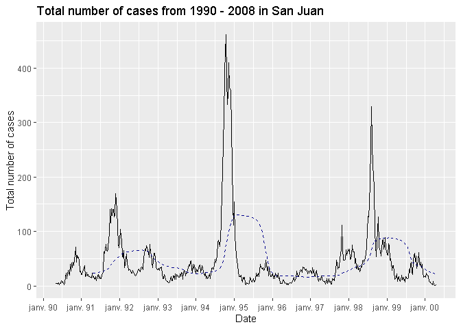

    # look for seasonality, depending on the week of the year
    merged_sj_train %>% filter("1991" <= year & year <= "1999") %>% 
      ggplot(aes(x = weekofyear, y = total_cases, color = factor(year))) +
      geom_line()

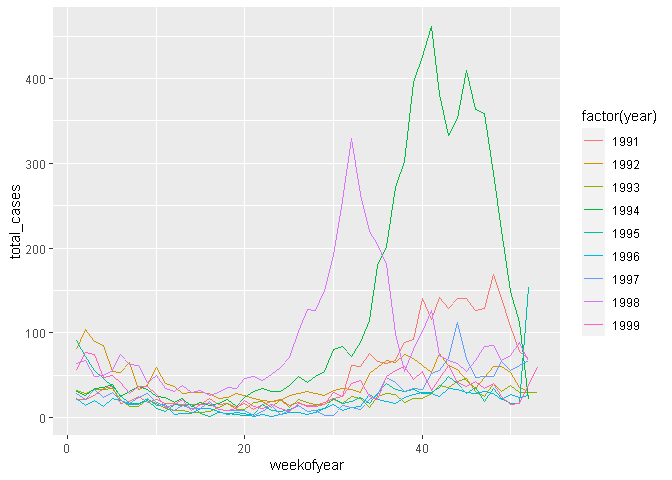

We do similar plots for San Juan. There’s also trend in the data. There
are more cases on weeks 30-52.  
In the following, we draw the two histograms of the number of cases and
look at their mean and variance:

    # draw the two histograms
    iq_histogram <- ggplot(data=merged_iq_train, aes(total_cases)) +
      geom_histogram(aes(y =..density..), fill = "orange") +
      geom_density() +
      ggtitle("Histogram of total cases in Iquitos ")

    sj_histogram <- ggplot(data=merged_sj_train, aes(total_cases)) +
      geom_histogram(aes(y =..density..), fill = "orange") +
      geom_density() + 
      ggtitle("Histogram of total cases in San Juan ") 

    grid.arrange(iq_histogram, sj_histogram, ncol=2)

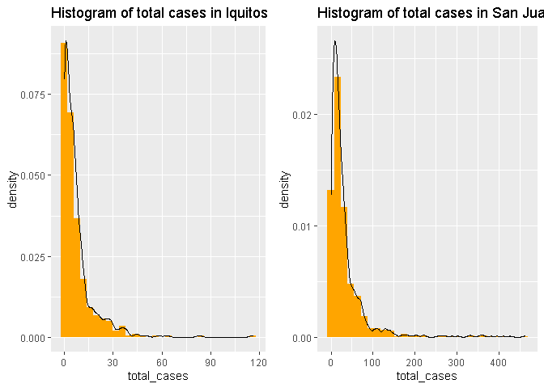

    mean(merged_iq_train$total_cases) # mean of Iquitos

    ## [1] 7.565385

    var(merged_iq_train$total_cases) # variance of Iquitos

    ## [1] 115.8955

    mean(merged_sj_train$total_cases) # mean of San Juan

    ## [1] 34.18056

    var(merged_sj_train$total_cases) # variance of San Juan

    ## [1] 2640.045

The number of cases for both cities do not follow Gaussian distributions
and are natural numbers. Therefore, we will assume that they follow
Poisson distribution or Negative Binomial distribution, and in
particular Negative Binomial distribution as the mean is much smaller
than the variance. In fact, the Poisson distribution can be interpreted
as a special case of the Negative Binomial distribution when the
parameter *r* → ∞ and is used as a way to model an over-dispersed
Poisson distribution.

## Modeling and Prediction

### Preparing the data for training and testing

In the following, we will split the data into a training set and a
testing set. As our data is time series, instead of a random selection
of each set, we split our time series with respect to chronology, in
order to train our models on the past data, and test the predictions on
the future.

    ##################Split train and test sets
    # For Iquitos
    iq_train_size <- round(nrow(merged_iq_train) * 0.8)
    iq_train <- head(merged_iq_train, iq_train_size)
    iq_test <- tail(merged_iq_train, nrow(merged_iq_train) - iq_train_size)
    # For San Juan
    sj_train_size <- round(nrow(merged_sj_train) * 0.8)
    sj_train <- head(merged_sj_train, sj_train_size)
    sj_test <- tail(merged_sj_train, nrow(merged_sj_train) - sj_train_size)

The MAE score will be used, as in the competition, to evaluate different
models.

    mae<-function(y, ychap)
    {
      return(round(mean(abs(y-ychap)), digit = 2))
    }

### Generalized Linear Models with Negative Binomial Distribution family.

### GAM models

We first fit a GAM model with the Negative Binomial distribution family,
using temperature features, the population feature and moreover, Time,
weekofyear to model trend and seasonality. After that, we look at
another model, this time adding auto-regressive features such as lag
variables.

For Iquitos:

    g1 <- gam(total_cases ~ s(reanalysis_specific_humidity_g_per_kg) + s(reanalysis_dew_point_temp_k) + s(ndvi_sw)
      + s(population_total) 
      + s(Time) + s(weekofyear) 
      ,family = nb(), data = iq_train, method = "REML")
    #gam.check(g1)
    summary(g1)

    ## 
    ## Family: Negative Binomial(2.737) 
    ## Link function: log 
    ## 
    ## Formula:
    ## total_cases ~ s(reanalysis_specific_humidity_g_per_kg) + s(reanalysis_dew_point_temp_k) + 
    ##     s(ndvi_sw) + s(population_total) + s(Time) + s(weekofyear)
    ## 
    ## Parametric coefficients:
    ##             Estimate Std. Error z value Pr(>|z|)    
    ## (Intercept)  1.10561    0.07046   15.69   <2e-16 ***
    ## ---
    ## Signif. codes:  0 '***' 0.001 '**' 0.01 '*' 0.05 '.' 0.1 ' ' 1
    ## 
    ## Approximate significance of smooth terms:
    ##                                            edf Ref.df  Chi.sq p-value    
    ## s(reanalysis_specific_humidity_g_per_kg) 5.502  6.717  20.405 0.00479 ** 
    ## s(reanalysis_dew_point_temp_k)           1.003  1.004   2.268 0.13303    
    ## s(ndvi_sw)                               2.134  2.708   2.221 0.41128    
    ## s(population_total)                      5.991  6.323   1.685 0.94152    
    ## s(Time)                                  4.441  4.654   1.014 0.96198    
    ## s(weekofyear)                            4.750  5.868 104.960 < 2e-16 ***
    ## ---
    ## Signif. codes:  0 '***' 0.001 '**' 0.01 '*' 0.05 '.' 0.1 ' ' 1
    ## 
    ## R-sq.(adj) =  0.414   Deviance explained = 68.7%
    ## -REML = 1042.7  Scale est. = 1         n = 416

    #plot.gam(g1)

The deviance explained is 68.7%. The variables weekofyear and
reanalysis\_specific\_humidity\_g\_per\_kg are significant (with very
small p-values) in predicting the number of cases. We look at the ACF,
PACF and the graph of the residuals:

    # on train set
    train_ychap <- predict(g1, newdata = iq_train, type = "response")
    # look at ACF and PACF of residuals to see if there's auto-correlation
    par(mfrow=c(1,2))
    acf(iq_train$total_cases - train_ychap)
    pacf(iq_train$total_cases - train_ychap)

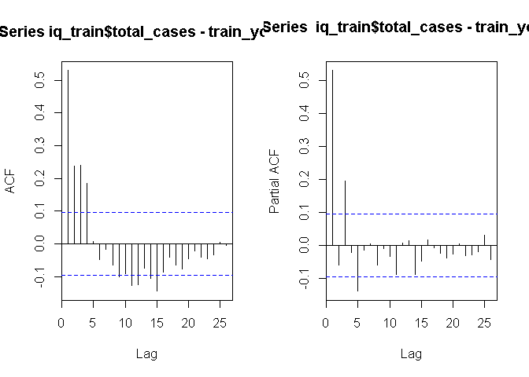

    startTime_iq <- as.Date("2001-01-01")
    endTime_iq <- as.Date("2009-12-24")
    # create a start and end time R object
    limits_iq <- c(startTime_iq, endTime_iq)
    iq_weekly_cases <- ggplot(iq_train, aes(week_start_date, total_cases - train_ychap)) +
      geom_line(na.rm=TRUE) + 
      geom_ma(ma_fun = SMA, n = 52) + # moving average with period of 52 weeks to detect trend
      ggtitle("Residuals from 2001 - 2010 in Iquitos") +
      xlab("Date") + ylab("Residual of number of cases")
    iq_weekly_cases

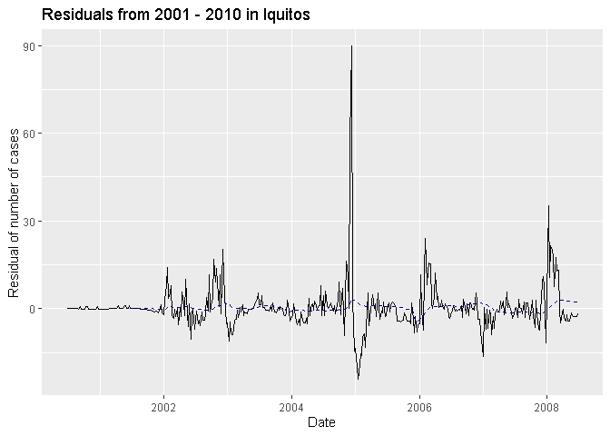

There are still a lot of auto-correlations in the data and there’s a
problem with the variance in the residues. We look at how it fits on the
testing set and look at the MAE score:

    # on test set
    test_ychap <- predict(g1, newdata = iq_test, type = "response")

    plot(iq_test$total_cases, type='l')
    lines(test_ychap,col='red')

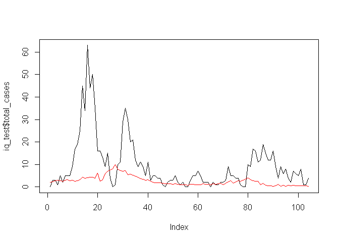

    mae(iq_test$total_cases, test_ychap)

    ## [1] 7.66

One idea to improve the model is to fit a SARIMA model to the residuals.
In the following, to make things simple, we will just add lag variables
to improve the model:

    g2 <- gam(total_cases ~ s(reanalysis_specific_humidity_g_per_kg) + s(reanalysis_dew_point_temp_k) + s(ndvi_sw)
      + s(population_total) 
      + s(Time) + s(weekofyear) 
      + s(log(lag_1_total_cases+1)) + s(log(lag_2_total_cases+1))+ s(log(lag_3_total_cases+1))
      ,family = nb(), data = iq_train, method = "REML")
    #gam.check(g2)
    summary(g2)

    ## 
    ## Family: Negative Binomial(4.892) 
    ## Link function: log 
    ## 
    ## Formula:
    ## total_cases ~ s(reanalysis_specific_humidity_g_per_kg) + s(reanalysis_dew_point_temp_k) + 
    ##     s(ndvi_sw) + s(population_total) + s(Time) + s(weekofyear) + 
    ##     s(log(lag_1_total_cases + 1)) + s(log(lag_2_total_cases + 
    ##     1)) + s(log(lag_3_total_cases + 1))
    ## 
    ## Parametric coefficients:
    ##             Estimate Std. Error z value Pr(>|z|)    
    ## (Intercept)   1.1096     0.0601   18.46   <2e-16 ***
    ## ---
    ## Signif. codes:  0 '***' 0.001 '**' 0.01 '*' 0.05 '.' 0.1 ' ' 1
    ## 
    ## Approximate significance of smooth terms:
    ##                                            edf Ref.df Chi.sq  p-value    
    ## s(reanalysis_specific_humidity_g_per_kg) 5.665  6.873 17.899  0.01297 *  
    ## s(reanalysis_dew_point_temp_k)           1.001  1.001  0.650  0.42051    
    ## s(ndvi_sw)                               2.139  2.710  3.606  0.22351    
    ## s(population_total)                      7.181  7.927 43.288  < 2e-16 ***
    ## s(Time)                                  1.003  1.003  9.701  0.00187 ** 
    ## s(weekofyear)                            3.621  4.532 24.965 8.71e-05 ***
    ## s(log(lag_1_total_cases + 1))            1.001  1.003 48.568  < 2e-16 ***
    ## s(log(lag_2_total_cases + 1))            4.337  5.338 30.314 2.01e-05 ***
    ## s(log(lag_3_total_cases + 1))            2.681  3.424  7.424  0.09342 .  
    ## ---
    ## Signif. codes:  0 '***' 0.001 '**' 0.01 '*' 0.05 '.' 0.1 ' ' 1
    ## 
    ## R-sq.(adj) =  0.675   Deviance explained = 78.4%
    ## -REML = 973.49  Scale est. = 1         n = 416

    #plot.gam(g2)

    # on train set
    train_ychap <- predict(g2, newdata = iq_train, type = "response")
    # look at ACF and PACF of residuals to see if there's auto-correlation
    par(mfrow=c(1,2))
    par("mar"=c(5, 4, 4, 1))
    acf(iq_train$total_cases - train_ychap)
    pacf(iq_train$total_cases - train_ychap)

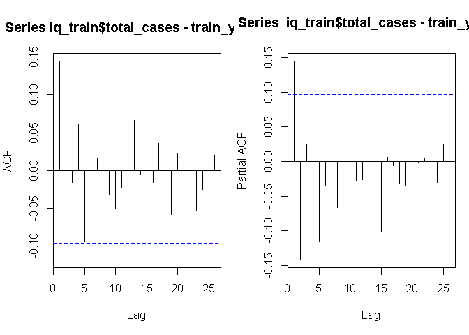

    startTime_iq <- as.Date("2001-01-01")
    endTime_iq <- as.Date("2009-12-24")
    # create a start and end time R object
    limits_iq <- c(startTime_iq, endTime_iq)
    iq_weekly_cases <- ggplot(iq_train, aes(week_start_date, total_cases - train_ychap)) +
      geom_line(na.rm=TRUE) + 
      geom_ma(ma_fun = SMA, n = 52) + # moving average with period of 52 weeks to detect trend
      ggtitle("Residuals from 2001 - 2010 in Iquitos") +
      xlab("Date") + ylab("Residual of number of cases")
    iq_weekly_cases

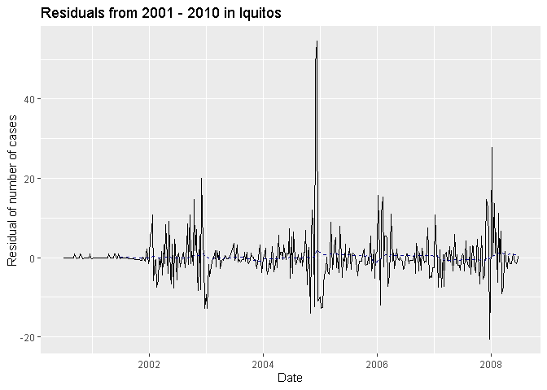

    # on test set
    par(mfrow=c(1,1))
    test_ychap <- predict(g2, newdata = iq_test, type = "response")
    mae(iq_test$total_cases, test_ychap)

    ## [1] 5.54

    plot(iq_test$total_cases, type='l')
    lines(test_ychap,col='red')

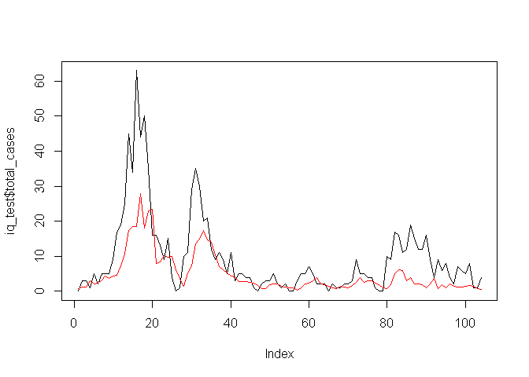

The deviance explained is increased to 78.4%, the MAE score is reduced
to 5.54. The ACF and PACF graphs show that the auto-correlation and
partial auto-correlation coefficients are small (&lt; 0.15), even though
we could possibly still fit an ARIMA model to the residuals to imrpove
more. There’s little trend remaining in the residuals, and there’s still
a problem with the variance of the residual. The graph fits better on
the testing data than the previous model.

### Regression Tree

In this section, we look at Regression tree, a simple method that
doesn’t require any assumption on the distribution of the variables, and
moreover, gives a way to select variables.

We first look at Iquitos:

    set.seed(123)
    tree_iq <- rpart(formula = total_cases ~ ., 
                     data = iq_train,
                     method = "anova")
    rpart.plot(tree_iq)

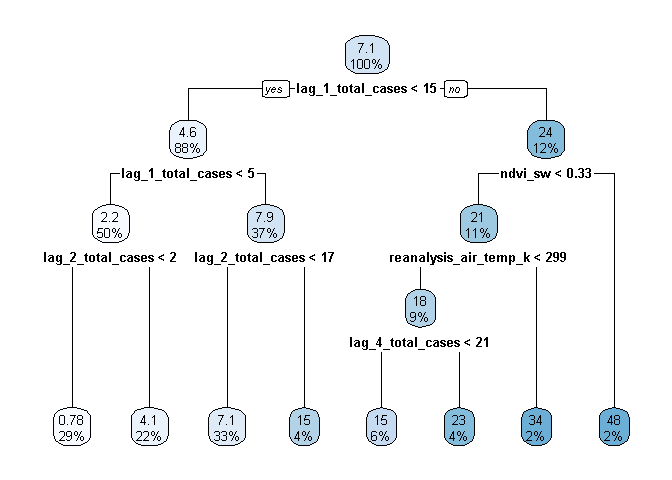

    ychap.tree_iq <- predict(tree_iq, newdata = iq_test)
    mae(iq_test$total_cases, ychap.tree_iq)

    ## [1] 5.49

    plot(iq_test$total_cases, type='l')
    lines(ychap.tree_iq,col='red')

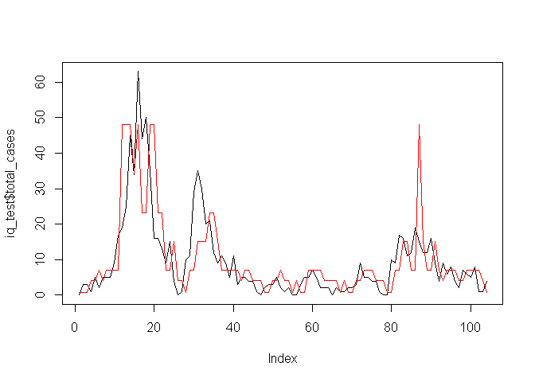

The MAE score is 5.49. The important features to predict the number of
cases are the number of cases from the last 1, 2, 4 weeks, the air
temperature, and the vegetation index ndvi\_sw.

For San Juan:

    tree_sj <- rpart(formula = total_cases ~ ., 
                     data = sj_train,
                     method = "anova")
    rpart.plot(tree_sj)

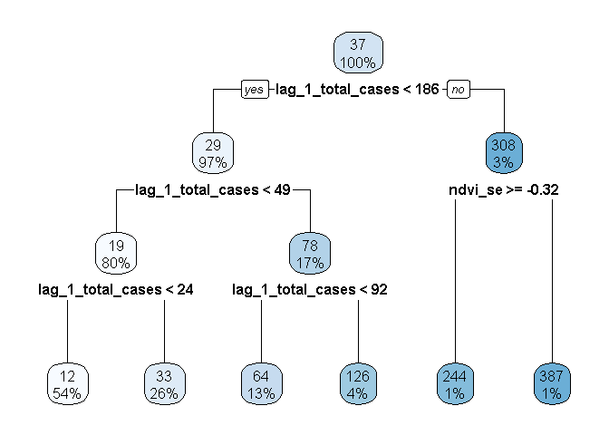

    ychap.tree_sj <- predict(tree_sj, newdata = sj_test)
    mae(sj_test$total_cases, ychap.tree_sj)

    ## [1] 8.95

    plot(sj_test$total_cases, type='l')
    lines(ychap.tree_sj,col='red')

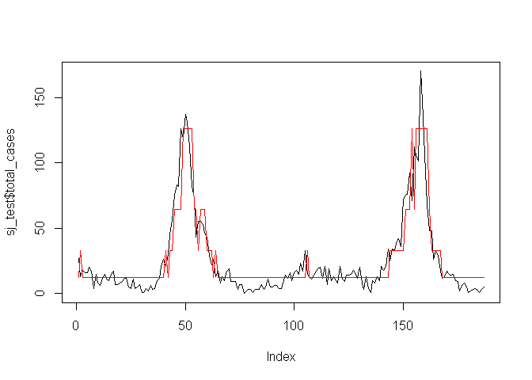

The MAE score is 8.95. The important features to predict the number of
cases are the number of cases from the last week and the vegetation
index ndvi\_se.

### Random Forest

We fit a random forest model for Iquitos with parameter mtry = 3, the
number of variables randomly sampled as candidates when forming each
split when building each tree. The parameter is searched using tuneRF.
We then look at the MAE score and its prediction graph on test set.

    ####### Iquitos
    # tune mtry
    t <- tuneRF(iq_train[,-34], unlist(iq_train[,34]),
                stepFactor = 0.5,
                plot = TRUE,
                ntree = 500,
                improve = 1e-5)

    ## mtry = 13  OOB error = 57.54013 
    ## Searching left ...
    ## mtry = 26    OOB error = 59.37676 
    ## -0.03191927 1e-05 
    ## Searching right ...
    ## mtry = 6     OOB error = 56.79889 
    ## 0.01288212 1e-05 
    ## mtry = 3     OOB error = 53.96547 
    ## 0.04988507 1e-05 
    ## mtry = 1     OOB error = 63.86488 
    ## -0.1834397 1e-05

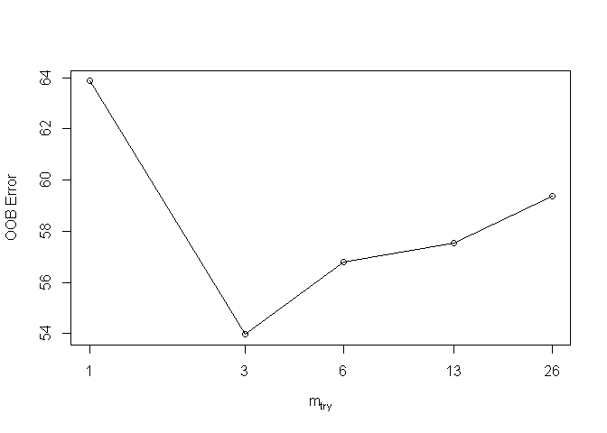

    rf1=randomForest(total_cases~.,ntree=500,data=iq_train, importance = TRUE, mtry = 3)
    rf1

    ## 
    ## Call:
    ##  randomForest(formula = total_cases ~ ., data = iq_train, ntree = 500,      importance = TRUE, mtry = 3) 
    ##                Type of random forest: regression
    ##                      Number of trees: 500
    ## No. of variables tried at each split: 3
    ## 
    ##           Mean of squared residuals: 54.72252
    ##                     % Var explained: 50.61

    rf1.fitted=predict(rf1,data=iq_train)
    rf1.forecast=predict(rf1,newdata=iq_test)
    mae(iq_test$total_cases,rf1.forecast)

    ## [1] 5.08

    plot(iq_test$total_cases, type='l')
    lines(rf1.forecast,col='red')

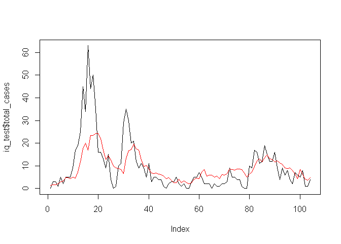

The variance explained is 50.61%. The MAE score on test set is 5.08,
better than the MAE score of 5.49 of the tree model. The prediction is
more robust and more accurate, as expected when comparing with a
decision tree.

Similarly for San Juan:

    ###### San Juan
    rf1=randomForest(total_cases~.,ntree=500,data=sj_train, importance = TRUE, mtry = 13)
    rf1

    ## 
    ## Call:
    ##  randomForest(formula = total_cases ~ ., data = sj_train, ntree = 500,      importance = TRUE, mtry = 13) 
    ##                Type of random forest: regression
    ##                      Number of trees: 500
    ## No. of variables tried at each split: 13
    ## 
    ##           Mean of squared residuals: 247.5671
    ##                     % Var explained: 91.81

    rf1.forecast=predict(rf1,newdata=sj_test)
    mae(sj_test$total_cases,rf1.forecast)

    ## [1] 7.55

    plot(sj_test$total_cases, type='l')
    lines(rf1.forecast,col='red')

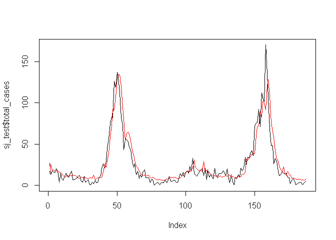

The Random Forest model works surprisingly well for San Juan, with
variance explained = 91.81%. The MAE score on test set is is 7.55.

### Times Series (ARIMA model)

    library(forecast)
    library(RColorBrewer)
    library(magrittr)
    library(dplyr)
    library(geoR)

First, we look at Iquitos. The total number of cases is a time series.

    ts_iq<-ts(iq_train$total_cases, frequency=1) 
    par(mfrow=c(1,2))
    plot(ts_iq)
    plot(diff(ts_iq)) # there's a problem with the variance, the series is not stationary

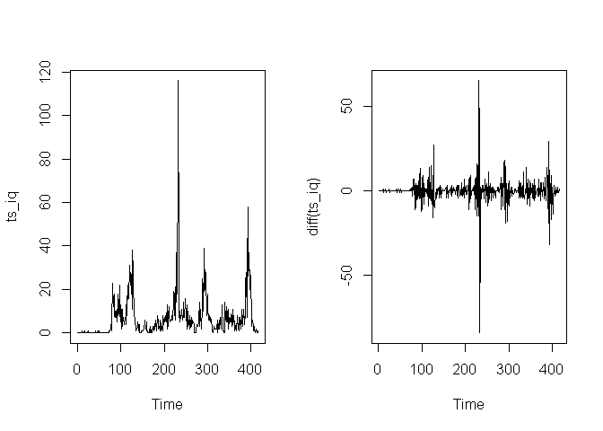

After taking the difference of the time series, we see that the mean is
0, however, the variance changes, hence even after taking the
difference, the series is not stationary. We could proceed by trying the
Box Cox transformation to stabilize the variance, or to continue fitting
an ARIMA model. We first proceed with the Box Cox transformation. For
this transformation of the series, we use a version with parameters
lambda1 and lambda2, because our data contains 0.

    # Two-parameter Box-Cox transform 
    boxcox.transform <- function(x, lambda1, lambda2) {
      if (lambda1!=0) {
        return(((x + lambda2) ^ lambda1 - 1) / lambda1)
      } else {
        return(log(x + lambda2))
      }
    }

    # Two-parameter inverse Box-Cox function
    boxcox.inv <- function(x, lambda1, lambda2) {
      if (lambda1!=0) {
        return((lambda1 * x + 1) ^ (1 / lambda1) - lambda2)
      } else {
        return(exp(x) - lambda2)
      }
    }

    lambda_estimates <- boxcoxfit(ts_iq, lambda2 = TRUE) 
    # use boxcox transformation, with 2 lambdas, because the series contains 0
    lambda1 <- lambda_estimates$lambda[1]
    lambda2 <- lambda_estimates$lambda[2]

    ts_iq_box_cox_transform <- boxcox.transform(ts_iq, lambda1, lambda2)
    par(mfrow=c(1,3))
    plot(ts_iq_box_cox_transform)
    acf(ts_iq_box_cox_transform, lag.max = 52*3) # ACF slowly decreases, need to take diff
    pacf(ts_iq_box_cox_transform, lag.max = 52*3)

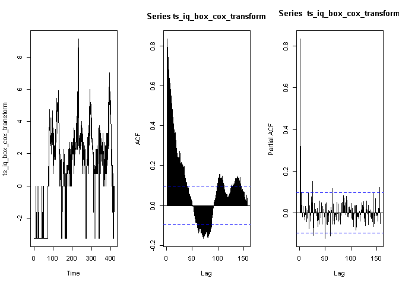

    par(mfrow=c(1,3))

    plot(diff(ts_iq_box_cox_transform))
    acf(diff(ts_iq_box_cox_transform), lag.max = 52*3)
    pacf(diff(ts_iq_box_cox_transform), lag.max = 52*3)

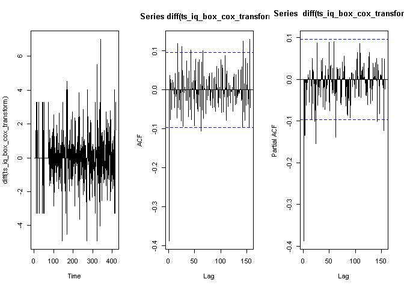

    par(mfrow=c(1,2))
    a1 <- acf(diff(ts_iq_box_cox_transform), lag.max = 52)
    b1 <- pacf(diff(ts_iq_box_cox_transform), lag.max = 52)

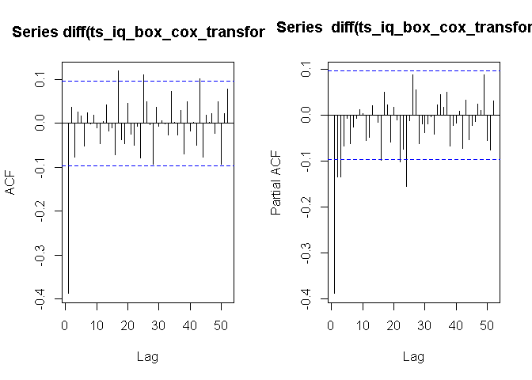

The P max, Q max are not clear, while pmax = 3 or 24, qmax = 1. We fit
an ARIMA model with p = 3, d = 1, q = 1 to the Box Cox transform of the
time series of total cases of Iquitos.

    #Pmax=0
    #Qmax=0
    ###pmax= 3 ou 24
    ###qmax= 1

    fit1_iq <- Arima(ts_iq_box_cox_transform, order = c(3,1,1))

    ts_iq_forecast_boxcox <- boxcox.transform(ts(merged_iq_train$total_cases,  frequency=1), lambda1, lambda2)
    refit_iq <- Arima(ts_iq_forecast_boxcox, model=fit1_iq)

We look at the ACF, PACF and the plot of the residuals.

    trainARIMA1_with_boxcox_transform_iq <- head(refit_iq$fitted, nrow(iq_train)) %>% as.numeric
    train_ARIMA1_iq <- boxcox.inv(trainARIMA1_with_boxcox_transform_iq, lambda1, lambda2)
    par(mfrow=c(1,3))
    acf(iq_train$total_cases - train_ARIMA1_iq)
    pacf(iq_train$total_cases - train_ARIMA1_iq)
    plot(iq_train$total_cases - train_ARIMA1_iq)

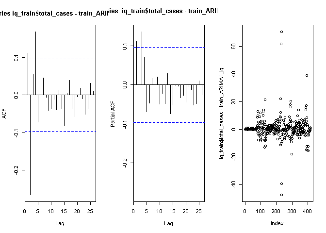

The ACF and PACF graphs show that there are still little
auto-correlations. The residuals look random, even though there’s still
a little problem with the variance.

    # check the MAE on test set
    prevARIMA1_with_boxcox_transform_iq <- tail(refit_iq$fitted, nrow(iq_test)) %>% as.numeric
    predict_ARIMA1_iq <- boxcox.inv(prevARIMA1_with_boxcox_transform_iq, lambda1, lambda2)
    mae(iq_test$total_cases, predict_ARIMA1_iq)

    ## [1] 4.42

    par(mfrow=c(1,1))
    plot(iq_test$total_cases,type='l')
    lines(predict_ARIMA1_iq%>%as.numeric, col='red')

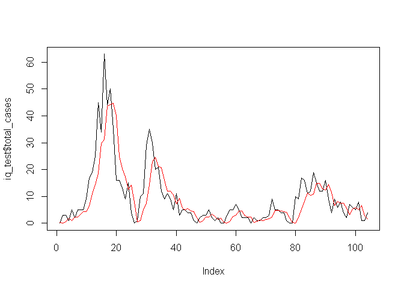

The MAE score on test set is 4.42 and our model could fit the data and
there seems to be a lag of 1-week in the prediction.

We proceed with taking the difference of the original series and fitting
another ARIMA model, in spite of the variance in the difference.

    par(mfrow=c(1,3))
    plot(diff(ts_iq))
    acf(diff(ts_iq), lag.max=52*3)
    pacf(diff(ts_iq), lag.max=52*3)

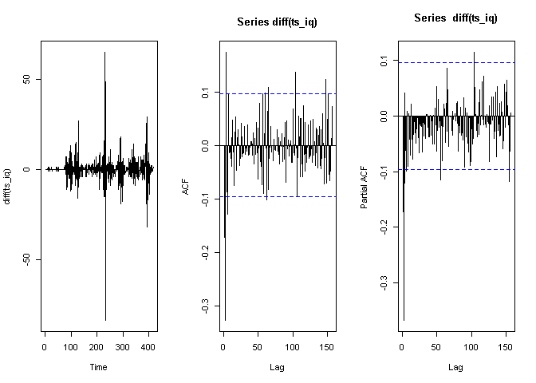

    #Pmax=0
    #Qmax=0
    acf(diff(ts_iq), lag.max=20)
    pacf(diff(ts_iq), lag.max=20)
    #pmax = 3
    #qmax = 6

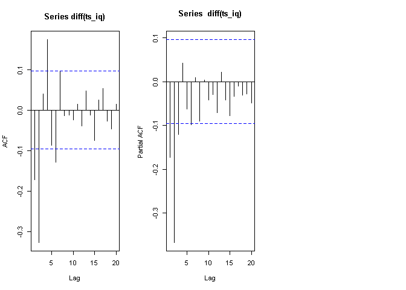

Looking at the ACF and PACF, we then fit an ARIMA model with P = 0, Q =
0, p = 3, d = 1, q = 6 and look again at the residuals and the ACF and
PACF.

    fit2_iq <- Arima(ts_iq, order=c(3,1,6), method=c("CSS"))
    ts_forecast <- ts(merged_iq_train$total_cases,  frequency=1)
    refit2_iq <- Arima(ts_forecast, model=fit2_iq)

    # see if there is still residual on the training set
    trainARIMA2_iq <- head(refit2_iq$fitted, nrow(iq_train)) %>% as.numeric
    par(mfrow=c(1,1))
    plot(iq_train$total_cases - trainARIMA2_iq)

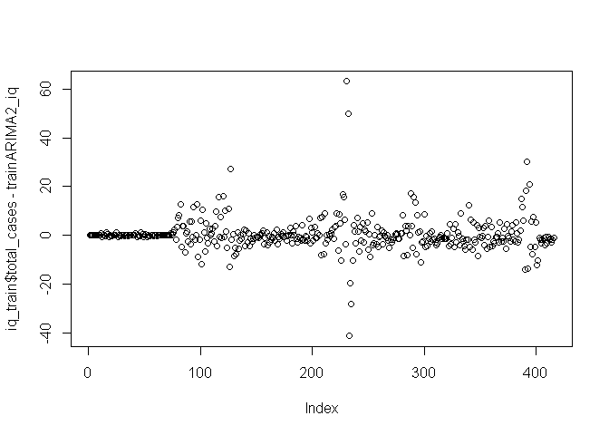

    par(mfrow=c(1,2))
    acf(iq_train$total_cases - trainARIMA2_iq)
    pacf(iq_train$total_cases - trainARIMA2_iq)

The residuals look random, and the ACF and PACF do not show any
auto-correlations.

    # MAE on test set
    prevARIMA2_iq <- tail(refit2_iq$fitted, nrow(iq_test))
    mae(iq_test$total_cases, prevARIMA2_iq)

    ## [1] 4.27

    par(mfrow=c(1,1))
    plot(iq_test$total_cases,type='l')
    lines(prevARIMA2_iq%>%as.numeric, col='red')

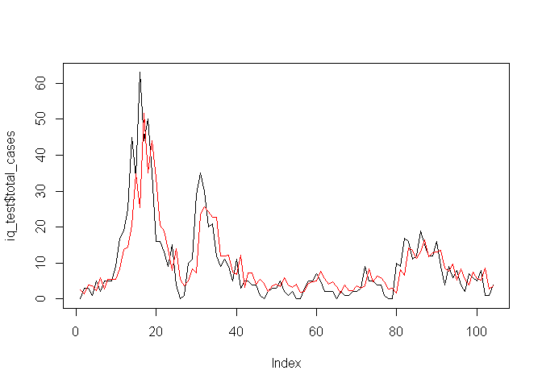

The MAE score on the test set is 4.27 and we could predict the peaks,
even though there seems to be a lag of 1 week.

### Gradient Boosting

In this section, we build Gradient Boosted trees models, which are
powerful ensembles of decision trees as weak learners. Unlike Random
Forest models, which perform well with little hyper-parameters tuning,
for GBM models, we need to tune boosting parameters such as the number
of trees and the learning rate, as well as tree specific parameters such
as tree depth and the minimum numbers of observations in the terminal
nodes. For simplicity, we will just use a grid search to find some best
hyper-parameters. The family distribution is “poisson” for counting
data.

For Iquitos:

    # hyper_grid <- expand.grid(
    #   shrinkage = c(.05, .1, .2),
    #   interaction.depth = c(1, 2, 3),
    #   n.minobsinnode = c(5, 7, 10),
    #   bag.fraction = c(.65, .8, 1), 
    #   optimal_trees = 0,               # number of trees
    #   min_error = 0                     # min error
    # )
    # 
    # # grid search
    # for(i in 1:nrow(hyper_grid)) {
    #   # train model
    #   print(i)
    #   gbm.tune <- gbm(
    #     formula = total_cases ~ .,
    #     distribution = "poisson",
    #     data = iq_train_,
    #     n.trees = 2000,
    #     interaction.depth = hyper_grid$interaction.depth[i],
    #     shrinkage = hyper_grid$shrinkage[i],
    #     n.minobsinnode = hyper_grid$n.minobsinnode[i],
    #     bag.fraction = hyper_grid$bag.fraction[i],
    #     train.fraction = .75,
    #     n.cores = NULL, # will use all cores by default
    #     verbose = FALSE
    #   )
    #   
    #   # add min training error and trees to grid
    #   hyper_grid$optimal_trees[i] <- which.min(gbm.tune$valid.error)
    #   hyper_grid$min_error[i] <- min(gbm.tune$valid.error)
    # }
    # 
    # hyper_grid %>% 
    #   dplyr::arrange(min_error) %>%
    #   head(10)

    set.seed(123)
    gbm.fit <- gbm(
      formula = total_cases ~ .,
      distribution = "poisson",
      data = iq_train_,
      n.trees = 300,
      interaction.depth = 2,
      shrinkage = 0.05,
      cv.folds = 5,
      bag.fraction = 0.8,
      n.minobsinnode = 7,
      train.fraction = .75,
      n.cores = NULL, # will use all cores by default
      verbose = FALSE
      )  

    best <- which.min(gbm.fit$cv.error) # find index for the number of trees with minimum CV error
    #best
    #gbm.fit$cv.error[best]
    #gbm.perf(gbm.fit, method = "cv")
    pred_iq <- predict(gbm.fit, n.trees = best, iq_test_, type="response")
    mae(iq_test$total_cases, pred_iq) # 4.55

    ## [1] 4.55

    plot(iq_test$total_cases,type='l')
    lines(pred_iq, col='red')

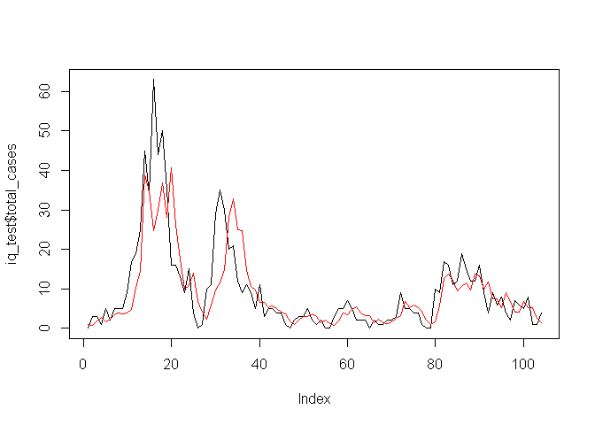

The MAE score is 4.55, lower than the one of Random Forest.

Similarly for San Juan:

    # for reproducibility
    set.seed(123)
    # hyper_grid <- expand.grid(
    #   shrinkage = c(.05, .1, .2),
    #   interaction.depth = c(1, 2, 3),
    #   n.minobsinnode = c(5, 7, 10),
    #   bag.fraction = c(.65, .8, 1), 
    #   optimal_trees = 0,               # number of trees
    #   min_error = 0                     # min error
    # )
    # 
    # # grid search
    # for(i in 1:nrow(hyper_grid)) {
    #   # train model
    #   print(i)
    #   gbm.tune <- gbm(
    #     formula = total_cases ~ .,
    #     distribution = "poisson",
    #     data = sj_train,
    #     n.trees = 2000,
    #     interaction.depth = hyper_grid$interaction.depth[i],
    #     shrinkage = hyper_grid$shrinkage[i],
    #     n.minobsinnode = hyper_grid$n.minobsinnode[i],
    #     bag.fraction = hyper_grid$bag.fraction[i],
    #     train.fraction = .75,
    #     n.cores = NULL, # will use all cores by default
    #     verbose = FALSE
    #   )
    #   
    #   # add min training error and trees to grid
    #   hyper_grid$optimal_trees[i] <- which.min(gbm.tune$valid.error)
    #   hyper_grid$min_error[i] <- min(gbm.tune$valid.error)
    # }
    # 
    # hyper_grid %>% 
    #   dplyr::arrange(min_error) %>%
    #   head(10)

    set.seed(123)
    gbm.fit <- gbm(
      formula = total_cases ~ .,
      distribution = "poisson",
      data = sj_train_,
      n.trees = 500,
      interaction.depth = 3,
      shrinkage = 0.2,
      cv.folds = 5,
      bag.fraction = 0.8,
      train.fraction = .75,
      n.cores = NULL, # will use all cores by default
      verbose = FALSE
    )  

    best <- which.min(gbm.fit$cv.error) # find index for the number of trees with minimum CV error
    #best
    #gbm.fit$cv.error[best]
    #gbm.perf(gbm.fit, method = "cv")
    pred_sj <- predict(gbm.fit, n.trees = best, sj_test_, type="response")
    mae(sj_test$total_cases, pred_sj)

    ## [1] 7.74

    plot(sj_test$total_cases,type='l')
    lines(pred_sj, col='red')

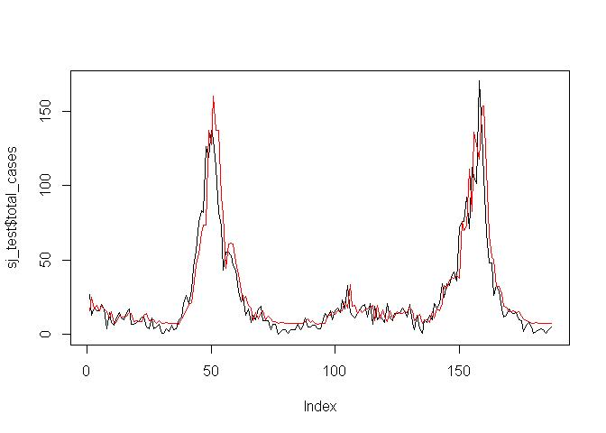

### Expert Aggregation (Exponentiated Gradient forecaster)

In this section, we collect some of the models above and put together an
aggregation of experts model, a strategy in sequential learning. This
model could perform as best as the convex combination of the best
experts, hence in the long run could potentially outperform the best
expert.

For Iquitos, we will put together the following models:

-   a GAM model, MAE = 5.54  
-   a CART model, MAE = 5.49  
-   a Random Forest model, MAE = 5.09  
-   a ARIMA model, MAE = 4.27  
-   a Boosted Tree model, MAE = 4.41

<!-- -->

    set.seed(123)
    gam_iq <- gam(total_cases ~ s(reanalysis_specific_humidity_g_per_kg) + s(reanalysis_dew_point_temp_k) + s(ndvi_sw)
              + s(population_total) 
              + s(Time) + s(weekofyear) 
              + s(log(lag_1_total_cases+1)) + s(log(lag_2_total_cases+1))+ s(log(lag_3_total_cases+1))
              ,family = nb(), data = iq_train, method = "REML")
    gam_iq_forecast <- predict(gam_iq, newdata = iq_test, type = "response")
    #mae(gam_iq_forecast, iq_test$total_cases)
    #########################################################################
    tree_iq <- rpart(formula = total_cases ~ ., 
                     data = iq_train,
                     method = "anova")
    tree_iq_forecast <- predict(tree_iq, newdata = iq_test)
    #mae(tree_iq_forecast, iq_test$total_cases)
    #########################################################################
    rf_iq <- randomForest(total_cases~.,ntree=500,data=iq_train, importance = TRUE, mtry = 3)
    rf_iq_forecast <- predict(rf_iq,newdata=iq_test)
    #mae(rf_iq_forecast, iq_test$total_cases)
    #########################################################################
    ts_iq<-ts(iq_train$total_cases, frequency=1) 
    fit2_iq <- Arima(ts_iq, order=c(3,1,6), method=c("CSS"))
    ts_forecast <- ts(merged_iq_train$total_cases,  frequency=1)
    refit2_iq <- Arima(ts_forecast, model=fit2_iq)
    arima_iq_forecast <- tail(refit2_iq$fitted, nrow(iq_test))
    #mae(arima_iq_forecast, iq_test$total_cases)
    #########################################################################
    gbm.fit <- gbm(
      formula = total_cases ~ .,
      distribution = "poisson",
      data = iq_train_,
      n.trees = 300,
      interaction.depth = 2,
      shrinkage = 0.05,
      cv.folds = 5,
      bag.fraction = 0.8,
      n.minobsinnode = 7,
      train.fraction = .75,
      n.cores = NULL, # will use all cores by default
      verbose = FALSE
    )  

    best <- which.min(gbm.fit$cv.error) # find index for the number of trees with minimum CV error
    gbm_iq_forecast <- predict(gbm.fit, n.trees = best, iq_test_, type="response")
    #mae(gbm_iq_forecast, iq_test$total_cases)

The aggregation expert prediction is formed using the Exponentiated
Gradient forecaster algorithm. As our metric is MAE, we will be using
the absolute value function as the loss. We use model = “EWA” and
loss.gradient = TRUE as the EG forecaster algorithm is the EWA algorithm
with the gradient of the loss function as the loss vectors. It gives a
MAE score of 4.2.

    set.seed(123)
    experts <- cbind(gam_iq_forecast, tree_iq_forecast,
                     rf_iq_forecast, arima_iq_forecast,
                     gbm_iq_forecast)
    colnames(experts)<-c("gam", "tree", "forest", "arima", "gbm")

    MLpol <- mixture(Y = iq_test$total_cases, experts = experts, 
                            loss.type = "absolute", model = "EWA", loss.gradient = TRUE)
    aggregation_iq_forecast <- MLpol$prediction
    #mae(iq_test$total_cases, aggregation_iq_forecast) # 4.2
    par(mfrow=c(1,1))
    plot(iq_test$total_cases,type='l')
    lines(aggregation_iq_forecast, col='red')

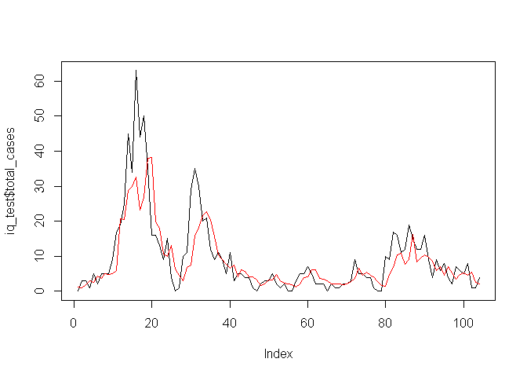

For San Juan, we will put together the following models:  
\* a Tree model, MAE = 8.95  
\* a Random Forest Model, MAE = 7.62  
\* a Boosted Tree Model, MAE = 7.26

    set.seed(123)
    tree_sj <- rpart(formula = total_cases ~ ., 
                     data = sj_train,
                     method = "anova")
    tree_sj_forecast <- predict(tree_sj, newdata = sj_test)
    #mae(sj_test$total_cases, tree_sj_forecast)
    rf_sj=randomForest(total_cases~.,ntree=500, data=sj_train, importance = TRUE, mtry = 13)
    rf_sj_forecast=predict(rf_sj,newdata=sj_test)
    #mae(sj_test$total_cases, rf_sj_forecast)

    gbm_sj <- gbm(
      formula = total_cases ~ .,
      distribution = "poisson",
      data = sj_train_,
      n.trees = 500,
      interaction.depth = 3,
      shrinkage = 0.2,
      cv.folds = 5,
      bag.fraction = 0.8,
      train.fraction = .75,
      n.cores = NULL, # will use all cores by default
      verbose = FALSE
    )  

    best <- which.min(gbm_sj$cv.error) # find index for the number of trees with minimum CV error
    #best
    #gbm.fit$cv.error[best]
    #gbm.perf(gbm.fit, method = "cv")
    bgm_sj_forecast <- predict(gbm_sj, n.trees = best, sj_test_, type="response")
    #mae(sj_test$total_cases, bgm_sj_forecast) # 7.26

    set.seed(123)
    experts <- cbind(tree_sj_forecast,
                     rf_sj_forecast,
                     bgm_sj_forecast)
    colnames(experts)<-c("tree", "forest", "gbm")
    MLpol <- mixture(Y = sj_test$total_cases, experts = experts, 
                     loss.type = "absolute", model = "EWA", loss.gradient = TRUE)
    aggregation_sj_forecast <- MLpol$prediction
    #mae(sj_test$total_cases, aggregation_sj_forecast) # 7.47
    par(mfrow=c(1,1))
    plot(sj_test$total_cases,type='l')
    lines(aggregation_sj_forecast, col='red')

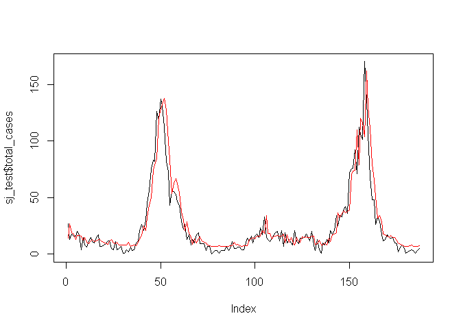

In the case of San Juan, our aggregation of expert advices gives a MAE
score of 7.47. Hence, in the case of Iquitos, the EG strategy proves to
be useful as it gives predictions even better than the best experts.

## Conclusion

In this report, we implemented major algorithms in machine learning:
Generalized Additive Model, ARIMA, Random Forest, Gradient Boosting
Trees, Exponentiated Gradient forecaster to predict the total number of
cases of Dengue disease. The models achieve good results without the
need to carefully tune the hyper-parameters. A difficulty in some of
these models is that the residuals have mean 0, but still have variance.
A direction to solve this problem, as suggested in class is to also
model the variance in the data. The graphs of some of the best models
show that the prediction is 1-week lag, so it might be better to predict
the number of cases of the current week using the environmental data
from the previous week. Together with a more fine tuning of the models,
a better feature engineering and a better choice of chaining the models
together, it’s promising that these models could achieve even better
results.
