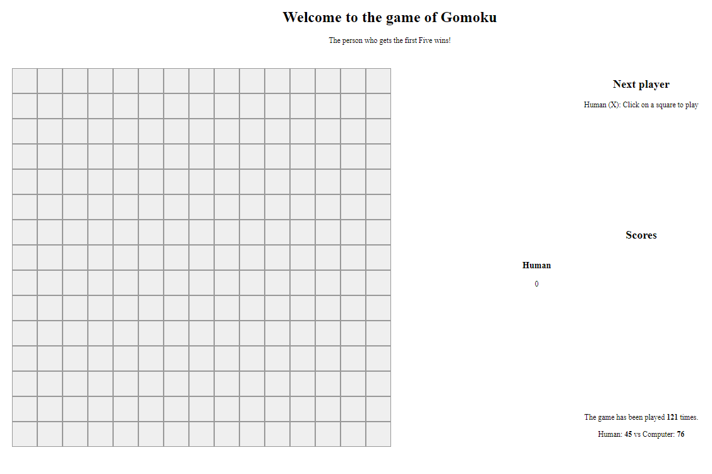

This is a board game, called Gomoku in Japanese and Co ca ro in Vietnamese.

In this game, the person who gets the first Five marks in a line wins.

The bot is implemented using the Minimax algorithm.

The game is created using React, CSS, Node.js, Express and MongoDB.

The game can be played at: http://cocarogame.herokuapp.com/

Source: <a href="https://github.com/longm89/gomoku_game">Gomoku game </a>
