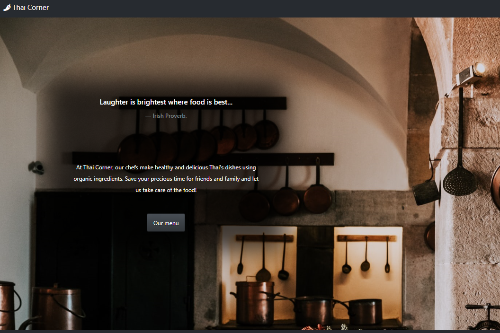

In this online restaurant app, the customers could choose dishes in the menu. After logging in, they could send their orders to the restaurant owner and check the orders' status. The owner (id: admin, pass: admin123) could receive and modify the status of the orders. The website is implemented using: React, React-Bootstrap, Node.js, Express and MongoDB. 

The app can be used at: <https://thaicorner.herokuapp.com/>

Source: <a href="https://github.com/longm89/thai_restaurant">Online Thai restaurant </a>
